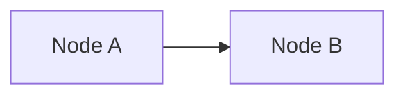

# Create Diagrams

Add Mermaid diagrams to `docs/architecture/diagrams.md` or feature docs.

## Diagram Format

Follow existing pattern in `docs/architecture/diagrams.md`:

```markdown
## Diagram N: [Title]
[One-line intro]

- Bullet context.


```

## Diagram Types

- **flowchart LR/TB** – Linear flows, system context
- **flowchart TB** with subgraph – Multi-component architecture
- **sequenceDiagram** – API/event sequences

## Naming

- Use `Diagram N: Descriptive Title` (N = next number in index)
- Add to Diagram Index at top of file
- Keep intro and bullets concise

## Placement

- Architecture/system diagrams → `docs/architecture/diagrams.md`
- Feature-specific flows → In feature doc or diagrams.md with feature prefix
