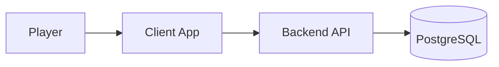
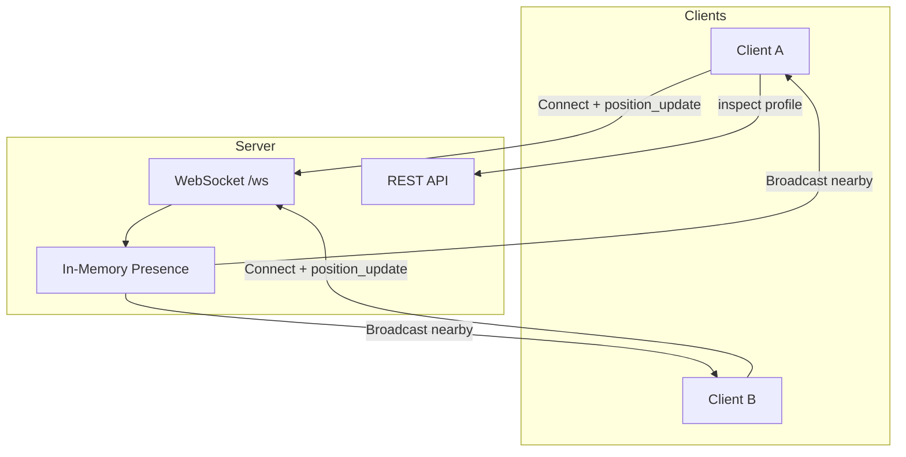
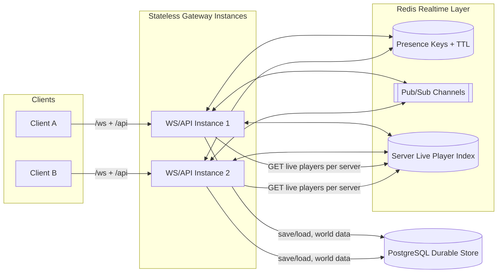
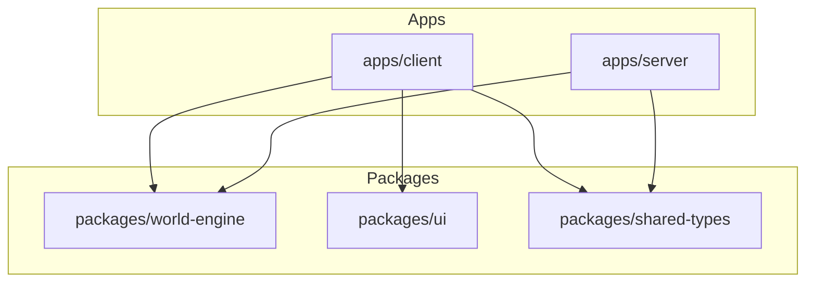
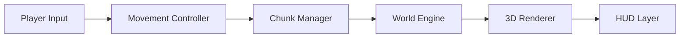
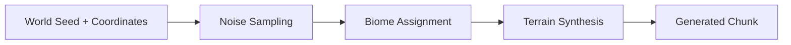
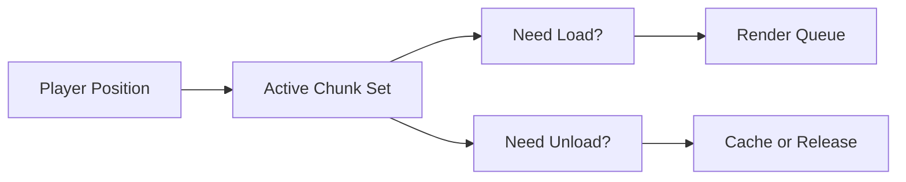
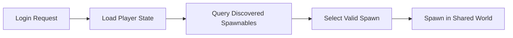
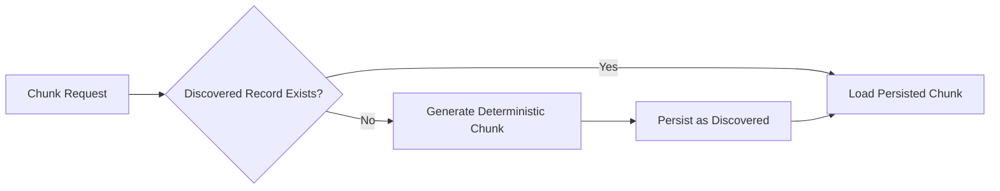
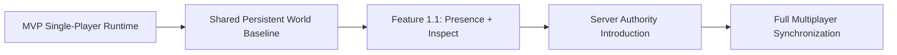

# Architecture Diagrams

## Purpose
Provide extraction-friendly Mermaid diagrams for architecture communication and future HTML portal rendering.

## Status
Active.

## Last Updated
2026-03-06

## Related Documents
- `docs/architecture/technical-architecture.md`
- `docs/mvp/mvp-scope.md`
- `docs/product/implementation-roadmap.md`

## Diagram Index
- [Diagram 1: System Context](#diagram-1-system-context)
- [Diagram 9: Feature 1.1 Multiplayer Flow](#diagram-9-feature-11-multiplayer-flow)
- [Diagram 10: Stateless Realtime with Redis](#diagram-10-stateless-realtime-with-redis)
- [Diagram 2: Monorepo Architecture](#diagram-2-monorepo-architecture)
- [Diagram 3: Client Runtime Flow](#diagram-3-client-runtime-flow)
- [Diagram 4: World Generation Pipeline](#diagram-4-world-generation-pipeline)
- [Diagram 5: Chunk Streaming Logic](#diagram-5-chunk-streaming-logic)
- [Diagram 6: Login and Player Spawn Flow](#diagram-6-login-and-player-spawn-flow)
- [Diagram 7: Shared World Chunk Lifecycle](#diagram-7-shared-world-chunk-lifecycle)
- [Diagram 8: Multiplayer Evolution Path](#diagram-8-multiplayer-evolution-path)

## Diagram 1: System Context
This diagram shows the MVP runtime boundary from player interaction to persistent storage.

- Explains client-server-database relationship.
- Emphasizes persistence as part of core loop.

## Diagram 9: Feature 1.1 Multiplayer Flow
This diagram shows the WebSocket presence and position sync flow added in Feature 1.1.

- Clients connect to `/ws?token=...` after REST bootstrap.
- Position updates are broadcast only to nearby players (chunk-radius based).

## Diagram 10: Stateless Realtime with Redis
This diagram shows the Feature 1.2 target topology for multi-instance WebSocket/API servers.

- Gateway instances stay stateless and coordinate presence through Redis.
- PostgreSQL remains the durable store; Redis carries ephemeral realtime state and events.

## Diagram 2: Monorepo Architecture
This diagram shows planned package and application boundaries in the monorepo.

- Highlights reuse of shared packages.
- Separates app runtime from shared logic.

## Diagram 3: Client Runtime Flow
This diagram shows how input and chunk logic flow into rendering and HUD output.

- Clarifies gameplay loop at client runtime level.
- Separates world rendering from UI shell output.

## Diagram 4: World Generation Pipeline
This diagram shows deterministic terrain generation from seed and coordinates.

- Makes deterministic pipeline explicit.
- Connects biome selection to final chunk output.

## Diagram 5: Chunk Streaming Logic
This diagram shows how movement triggers chunk load, generation checks, and unload decisions.

- Captures active chunk radius behavior.
- Shows load and unload in one runtime path.

## Diagram 6: Login and Player Spawn Flow
This diagram shows MVP login and spawn selection using discovered spawnable locations.

- Confirms spawn validation happens before gameplay.
- Shows bootstrap fallback for empty discovered sets.

## Diagram 7: Shared World Chunk Lifecycle
This diagram shows lazy generation and persistence for requested chunks.

- Distinguishes existing chunk load versus first generation.
- Shows discovery persistence as mandatory step.

## Diagram 8: Multiplayer Evolution Path
This diagram shows the intended path from MVP single-player runtime to future multiplayer authority.

- Feature 1.1 implements presence sync and inspect; authority remains client-side for movement.
- Preserves upgrade sequence from shared-world foundation.

## Export Notes
- Mermaid Live Editor: [https://mermaid.live](https://mermaid.live)
- Markdown renderers that support Mermaid can directly display this file.
