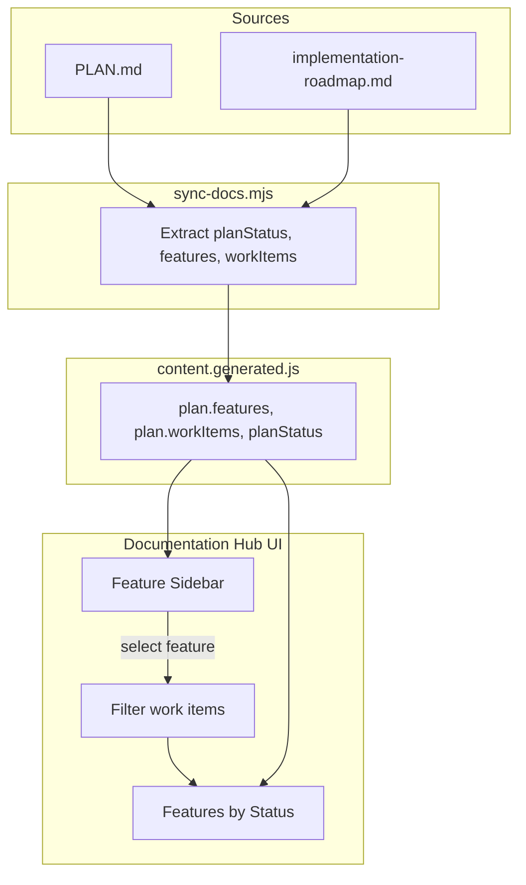
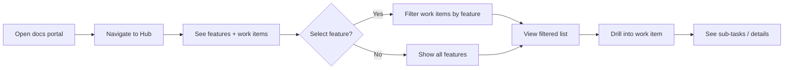
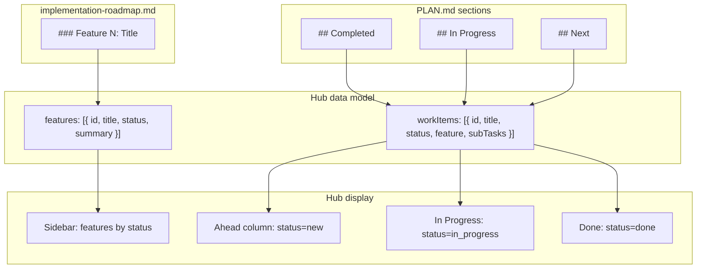

# Feature: Documentation Hub

## Purpose

The Documentation Hub is an internal backoffice-style platform that gives developers and stakeholders clear visibility into project execution. It surfaces features (planned, in progress, done) and work items (ahead, in progress, done) in a single navigable view, powered by existing `sync-docs.mjs` output and `content.generated.js`.

The hub consolidates what is currently spread across Home, Plan, and Tech tabs into a focused execution dashboard. Users can quickly answer: *What feature are we in? What’s done? What’s next? What’s in progress?*

## Scope

### In Scope

- **Features view**: Sidebar or primary navigation listing all roadmap features with status (planned / in progress / done).
- **Work items view**: Main content area showing work items grouped by execution status (Ahead / In Progress / Done).
- **Feature selection**: Selecting a feature filters or scopes the work items shown to that feature.
- **Status-based layout**: Three-column or section layout for Ahead, In Progress, Done.
- **Data source**: Content from `content.generated.js` (`plan.features`, `plan.workItems`, `planStatus`).
- **Backoffice aesthetic**: Clean, dense, information-first layout suitable for internal ops.
- **Integration**: Lives within the existing docs-site (port 5555) as a new primary view or tab.

### Out of Scope

- Editing features or work items from the hub (read-only; source of truth remains `PLAN.md` and roadmap).
- Real-time sync (content refreshed via `pnpm docs:sync`).
- User authentication or role-based access.
- Mobile-first or responsive redesign of the entire docs portal.
- New data extraction logic beyond what `sync-docs.mjs` already produces.

## User Flows

1. **View execution overview**
   - User opens docs portal (e.g. `http://localhost:5555`).
   - User navigates to the Documentation Hub (e.g. via "Hub" tab or as default view).
   - User sees sidebar with features (planned, in progress, done) and main area with work items grouped by Ahead / In Progress / Done.
   - User can immediately see current feature and work distribution.

2. **Filter by feature**
   - User sees feature list in sidebar (e.g. "Feature 1: MVP", "Feature 1.3: Documentation hub").
   - User clicks a feature.
   - Main area updates to show only work items belonging to that feature.
   - "All" option restores full view.

3. **Drill into work item**
   - User sees a work item card in one of the status columns.
   - User clicks the card or an expand control.
   - Card expands to show sub-tasks (if any) or links to related docs.
   - User can copy task title or navigate to related documentation.

4. **Switch between features and work items focus**
   - User can choose a "Features" view (feature-centric: select feature → see its items) or "Status" view (status-centric: see all items by Ahead / In Progress / Done).
   - Both views use the same underlying data; layout emphasis differs.

## Acceptance Criteria

- [ ] Hub view displays features in sidebar with clear status indicators (planned / in progress / done).
- [ ] Hub view displays work items in three groups: Ahead, In Progress, Done.
- [ ] Selecting a feature in the sidebar filters work items to that feature (or shows "All" when no feature selected).
- [ ] Work item cards show title, status badge, feature badge, and sub-tasks when present.
- [ ] Empty states: When a status column has no items, show "No items" or equivalent message.
- [ ] Data is read from `window.DOCS_PORTAL_CONTENT` (plan.features, plan.workItems); no new API.
- [ ] Hub is reachable from main navigation (e.g. "Hub" tab) and loads without errors when content is generated.
- [ ] Layout is backoffice-style: dense, scannable, information-first (not marketing-style).
- [ ] Current feature is visually emphasized (e.g. badge, highlight) in both sidebar and header.

## Examples

### Happy Path

- User opens hub → sees "Feature 1.3: Documentation hub" as current feature in sidebar with "in progress" badge.
- Main area shows:
  - **Ahead**: "Operations board and observability polish", "Realtime test hardening", "Product quality passes" (from PLAN.md Next).
  - **In Progress**: "Operations hardening" with sub-tasks visible.
  - **Done**: Long list of completed items (from PLAN.md Completed).
- User clicks "Feature 1.2: Redis infra" in sidebar → main area filters to show only Feature 1.2–related work items.

### Edge Cases

- **No work items**: If `plan.workItems` is empty, show "No work items. Run `pnpm docs:sync` and ensure PLAN.md has Completed, In Progress, and Next sections."
- **No features**: If `plan.features` is empty, sidebar shows "No features" and main area still shows work items if available.
- **Content not generated**: Same fallback as current portal: "Run `pnpm docs:sync` from the repository root, then refresh."
- **Work item with many sub-tasks**: Card shows first 3–5 sub-tasks with "…and N more" or expand control.
- **Feature with no work items**: Selecting that feature shows "No work items in this feature" in main area.

### UI Mock: Hub Layout (ASCII Wireframe)

```
+--------------------------------------------------------------------------------------------------+
| ROC  Rise Of Civilization · Internal · Feature 1.3: Documentation hub                           |
+--------------------------------------------------------------------------------------------------+
| [Hub] [Home] [Plan] [Tech]                                                                       |
+----------+---------------------------------------------------------------------------------------+
| FEATURES |  WORK ITEMS BY STATUS                                                                  |
|          |                                                                                      |
| ○ All    |  +------------------+  +------------------+  +------------------+                    |
|          |  | AHEAD            |  | IN PROGRESS      |  | DONE             |                    |
| ● M9     |  | (Next)           |  | (Current)        |  | (Completed)      |                    |
|   Feat   |  |                  |  |                  |  |                  |                    |
|   1.3    |  | • Operations     |  | • Operations     |  | • Monorepo       |                    |
|   (curr) |  |   board...       |  |   execution      |  |   scaffold       |                    |
|          |  | • Realtime test  |  |   kickoff        |  | • Workspace      |                    |
| ○ M8     |  |   hardening      |  |   [2 sub-tasks]  |  |   tooling        |                    |
|   Phase  |  | • Product        |  |                  |  | • Docker stack   |                    |
|   2.5    |  |   quality passes |  |                  |  | • Backend...     |                    |
|   (done) |  |                  |  |                  |  | • ...            |                    |
|          |  +------------------+  +------------------+  +------------------+                    |
| ○ M7     |                                                                                      |
|   Phase  |                                                                                      |
|   2      |                                                                                      |
|   (done) |                                                                                      |
|          |                                                                                      |
| ...      |                                                                                      |
+----------+---------------------------------------------------------------------------------------+
```

### UI Mock: Features View (Status-Centric)

```
+------------------------------------------+
| AHEAD (3)                                |
+------------------------------------------+
| ┌──────────────────────────────────────┐|
| │ Operations board and observability   │|
| │ Feature 1.3 · new                    │|
| │ • Simplify docs portal status board  │|
| │ • Add runbook snippets...             │|
| └──────────────────────────────────────┘|
| ┌──────────────────────────────────────┐|
| │ Realtime test hardening              │|
| │ Feature 1.3 · new                    │|
| └──────────────────────────────────────┘|
+------------------------------------------+
```

## Design

**Layout**: Sidebar (features) + main area (work items by status). Backoffice style: neutral palette, clear typography, dense information, no decorative imagery.

**Key elements**:
- Sidebar: Feature list with status pill (planned / in progress / done). Current feature highlighted.
- Main area: Three columns or sections — Ahead (status: `new`), In Progress (`in_progress`), Done (`done`).
- Work item card: Title, feature badge, status badge, optional sub-task list.
- Header: Retain existing topbar with current feature badge; hub adds feature filter context.

**Figma**: None. Use ASCII wireframes above and existing docs-site components (e.g. `WorkItemsBoard`, `StatusFilters`, `PhaseDashboard`) as reference.

## Diagrams

### Diagram 1: Documentation Hub Information Architecture

How content flows from source files into the hub and how users navigate it.



### Diagram 2: User Flow – View and Filter

Step-by-step user journey through the hub.



### Diagram 3: Data Model Mapping

How PLAN.md and roadmap map to hub display.



## Related Documents

- `docs-site/sync-docs.mjs` – Content extraction and `content.generated.js` generation
- `PLAN.md` – Source of Completed, In Progress, Next
- `docs/product/implementation-roadmap.md` – Source of features
- `docs-site/src/pages/PlanView/PlanView.js` – Existing plan/task UI to align or reuse
- `docs-site/src/components/WorkItemsBoard/WorkItemsBoard.js` – Board layout reference

---

## Technical Architecture

### Components

| Component | Responsibility | Location |
|-----------|----------------|----------|
| **HubPage** | Primary view container; sidebar + main area layout; feature filter state | `docs-site/src/pages/HubView/` or `HubPage/` |
| **PhaseSidebar** | Lists features with status (planned / in progress / done); current feature highlighted; "All" option | `docs-site/src/components/PhaseSidebar/` |
| **FeaturesByStatus** | Three-column layout: Ahead, In Progress, Done; renders WorkItemCard per column | `docs-site/src/components/FeaturesByStatus/` |
| **WorkItemCard** | Card: title, status badge, feature badge, sub-tasks (expandable or first 3–5 + "…and N more") | `docs-site/src/components/WorkItemCard/` |

### Data Flow

- **Source**: `window.DOCS_PORTAL_CONTENT` (no new API).
- **Data path**: `content.generated.js` → loaded by `main.tsx` before React mount → `loadPortalContent()` → passed to `AppLayout` → Hub.
- **Required fields**:
  - `plan.features`: `{ id, title, status, summary }[]` (status: `planned` | `in_progress` | `done`)
  - `plan.workItems`: `{ id, title, status, feature, subTasks }[]` (status: `new` | `in_progress` | `done`)
  - `planStatus.feature`: current feature label for header
- **Fallback**: `planStatus` normalizes to `workItems` via `normalizeWorkItems()` when `plan.workItems` is absent.

### Mapping to docs-site Structure

```
docs-site/
├── content.generated.js          # Generated by sync-docs.mjs; contains plan.features, plan.workItems
├── src/
│   ├── App.tsx                   # Loads content; renders AppLayout
│   ├── main.tsx                  # Loads content.generated.js script before mount
│   ├── lib/content.ts            # loadPortalContent() → window.DOCS_PORTAL_CONTENT
│   ├── types/content.ts          # DocsPortalContent, WorkItem, FeatureSummary
│   ├── pages/
│   │   ├── AppLayout/             # Tab nav: Hub | Home | Plan | Tech
│   │   ├── HubView/              # Hub page (PhaseSidebar + FeaturesByStatus)
│   │   ├── HomeView/             # Overview cards (may be consolidated)
│   │   ├── PlanView/             # Tasks/Board/More (may be deprecated or simplified)
│   │   └── TechView/             # Tech content (unchanged)
│   └── components/
│       ├── PhaseSidebar/         # NEW
│       ├── FeaturesByStatus/     # NEW (three-column layout)
│       ├── WorkItemCard/         # NEW (extract from WorkItemsBoard or create)
│       ├── WorkItemsBoard/       # Existing; may be reused or replaced by FeaturesByStatus
│       └── StatusFilters/        # Existing; feature filter logic may inform PhaseSidebar
```

### Non-Goals

- No new REST or WebSocket API.
- No database changes.
- No changes to `sync-docs.mjs` extraction logic beyond verification that `plan.features` and `plan.workItems` are present.

---

## Technical Specification

### API

**None.** All data is read from `window.DOCS_PORTAL_CONTENT` (populated by `content.generated.js`).

### Data Contract

| Source | Field | Shape |
|--------|-------|-------|
| `content.plan` | `features` | `{ id: string, title: string, status: 'planned' \| 'in_progress' \| 'done', summary?: string }[]` |
| `content.plan` | `workItems` | `{ id: string, title: string, status: 'new' \| 'in_progress' \| 'done', feature: string, subTasks: string[] }[]` |
| `content.planStatus` | `feature` | `string` (current feature label) |
| `content.overview` | `currentFeature` | `string` (fallback) |

### Component Tree

```
HubPage (or HubView)
├── PhaseSidebar
│   ├── "All" option
│   └── Feature list items (feature.id, feature.title, feature.status)
└── FeaturesByStatus
    ├── Column: Ahead (status === 'new')
    │   └── WorkItemCard[] (filtered by selectedFeatureId)
    ├── Column: In Progress (status === 'in_progress')
    │   └── WorkItemCard[]
    └── Column: Done (status === 'done')
        └── WorkItemCard[]
```

### Work Item Card Shape

```ts
interface WorkItem {
  id: string;
  title: string;
  status: 'new' | 'in_progress' | 'done';
  feature: string;
  subTasks: string[];
}
```

### Implementation Order

1. **Refactor docs-site structure** – Simplify navigation, make Hub the default/primary view.
2. **Create PhaseSidebar** – Feature list with status indicators, "All" option, current feature highlight.
3. **Create FeaturesByStatus** – Three-column layout (Ahead, In Progress, Done).
4. **Create WorkItemCard** – Reusable card component with title, badges, sub-tasks.
5. **Wire feature filter** – Selecting a feature filters `workItems` by `item.feature` matching feature id.
6. **Add Hub to navigation** – Hub tab (or default route); remove or consolidate redundant Plan/Home views.

---

## Implementation Tasks

Ordered tasks for the `/documentations` agent.

### 0. Evaluate: Refactor vs Create Fresh docs-site

**Task**: Evaluate whether to refactor the existing docs-site or create a new docs-site from scratch.

**Recommendation**: **Refactor existing docs-site.**

- **Current docs-site**: ~136 files, 3 main tabs (Home, Plan, Tech), `content.generated.js` already has `plan.features` and `plan.workItems`, `WorkItemsBoard` and `PlanView` have overlapping logic.
- **Refactor benefits**: Reuse existing content loading, sync, styles, and components; lower risk; faster delivery.
- **Create fresh benefits**: Clean slate, no legacy constraints. **Downside**: Duplicate sync-docs, content loading, styles; higher effort and risk.
- **Conclusion**: Refactor. The docs-site is manageable and the Hub is a consolidation of existing Plan + Home views.

**Output**: Document decision in this feature doc or a brief ADR; proceed with refactor tasks below.

### 1. Refactor docs-site: Simplify structure, make Hub the default view

- Add Hub as the primary/default tab in `AppLayout`.
- Change default `mainTab` from `'home'` to `'hub'`.
- Update tab order: Hub | Home | Plan | Tech (or Hub | Plan | Tech if Home is consolidated).
- Ensure `content.generated.js` is loaded before React mount (already done in `main.tsx`).

### 2. Verify content.generated.js has plan.features and plan.workItems

- Run `pnpm docs:sync` and inspect `content.generated.js`.
- Confirm `plan.features` and `plan.workItems` are present in `sync-docs.mjs` output.
- If missing, add or fix extraction in `sync-docs.mjs`.
- No schema changes expected; sync-docs already produces them.

### 3. Create PhaseSidebar component

- Location: `docs-site/src/components/PhaseSidebar/`.
- Props: `features: FeatureSummary[]`, `selectedFeatureId: string | 'all'`, `onFeatureSelect: (id: string | 'all') => void`, `currentFeatureLabel?: string`.
- Render: "All" option; list of features with status pill (planned / in progress / done).
- Highlight current feature (match `currentFeatureLabel` or feature with `status === 'in_progress'`).
- Co-located styles: `PhaseSidebar.styles.module.css`.
- Co-located story: `PhaseSidebar.stories.tsx`.

### 4. Create FeaturesByStatus component (three-column layout)

- Location: `docs-site/src/components/FeaturesByStatus/`.
- Props: `items: WorkItem[]`, `selectedFeatureId?: string | 'all'`.
- Filter: When `selectedFeatureId !== 'all'`, filter items by `item.feature` matching feature id.
- Columns: Ahead | In Progress | Done (status: `new`, `in_progress`, `done`).
- Each column: header with count, list of WorkItemCard.
- Empty state: "No items" or equivalent message per column.
- Co-located styles and story.

### 5. Create WorkItemCard component

- Location: `docs-site/src/components/WorkItemCard/`.
- Props: `item: WorkItem`.
- Render: title, status badge, feature badge, sub-tasks (first 3–5 with "…and N more" or expand control).
- Co-located styles and story.

### 6. Wire feature filter in HubPage

- HubPage receives `content` from AppLayout.
- State: `selectedFeatureId: string | 'all'` (default `'all'`).
- Pass to PhaseSidebar: `onFeatureSelect` updates state.
- Pass to FeaturesByStatus: `selectedFeatureId` for filtering.
- Match by `item.feature` === `feature.id` (e.g. "1.1", "1.2", "1.3").

### 7. Add Hub to navigation and create HubPage

- Create `HubPage` (or `HubView`) at `docs-site/src/pages/HubView/`.
- Render: PhaseSidebar + FeaturesByStatus (side-by-side layout per wireframe).
- Add "Hub" tab in AppLayout; set as default tab.
- Ensure header shows current feature badge (existing behavior).

### 8. Remove or consolidate redundant Plan/Home views

- If Hub replaces Plan as primary execution view: keep Plan as optional "More" tab or archive; remove Plan tab if Hub fully supersedes it.
- If Hub replaces Home: merge Home overview (Project, Current Feature, Last Updated) into Hub header or a compact summary strip; remove or simplify Home tab.
- Document final tab structure in this feature doc.

---

## Handoff

This document is ready for `/documentations` to implement. Implementation will extend the docs-site with a new Hub view, reusing `content.generated.js` and existing components where appropriate. Start with Task 0 (evaluate refactor vs create), then proceed through Tasks 1–8 in order.
